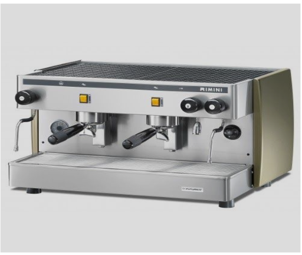
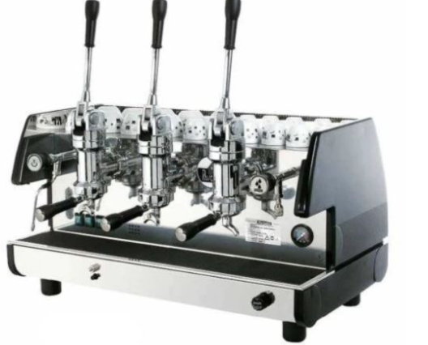

# OOPsDesignCaseStudy

## Chain of responsibility
According to wiki,  The chain-of-responsibility pattern is a behavioral design pattern consisting of a source of command objects and a series of processing objects.[1] Each processing object contains logic that defines the types of command objects that it can handle; the rest are passed to the next processing object in the chain. A mechanism also exists for adding new processing objects to the end of this chain.

## Coffee Machine
Write the working code to create a working coffee machine. Here are the desired features
1. It will be serving some beverages.
2. Each beverage will be made using some ingredients.
3. Assume time to prepare a beverage is the same for all cases.
4. The quantity of ingredients used for each beverage can vary. Also, the same ingredient (ex:
water) can be used for multiple beverages.
5. There would be N ( N is an integer ) outlet from which beverages can be served.

For N = 2 [ 2 outlets in a machine ]

For N = 3 [ 3 outlets in a machine ]

7. Maximum ​N​ beverages can be served in ​parallel​.
8. Any beverage can be served only if all the ingredients are available in terms of quantity.
9. There would be an indicator that would show which all ingredients are running low. We need
some methods to refill them.
10.Please provide functional integration test cases for maximum coverage.

Example: Consider Chai Point machine which serves these drinks: 
1. ginger tea
2. elaichi tea
3. coffee
4. hot milk
5. hot water

the machine has N outlets for serving these drinks
Note: Since there are N outlets, N people can take beverages at the same time.

[Input Test Json](https://www.npoint.io/docs/e8cd5a9bbd1331de326a )

## ConnectFour game

### Details
1. [Game details page](https://en.wikipedia.org/wiki/Connect_Four)
### Game Rules:
1. It is two player game. Each player have his turn alternatively.
2. In every tern Game should show states.
3. Player should enter the position of the next coin.
4. Game should declare a winner after a finishing move.
5. Undo is not supported.
6. Computer player is not supported.

